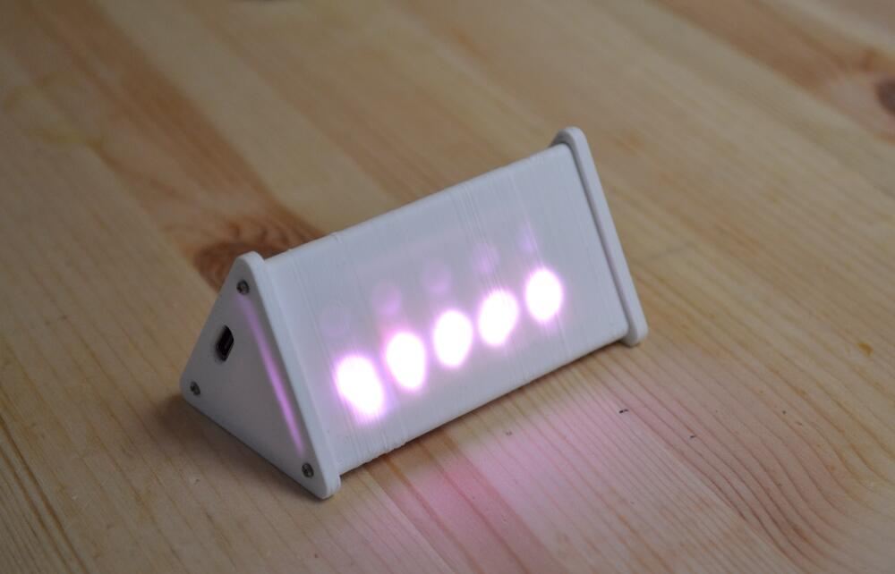
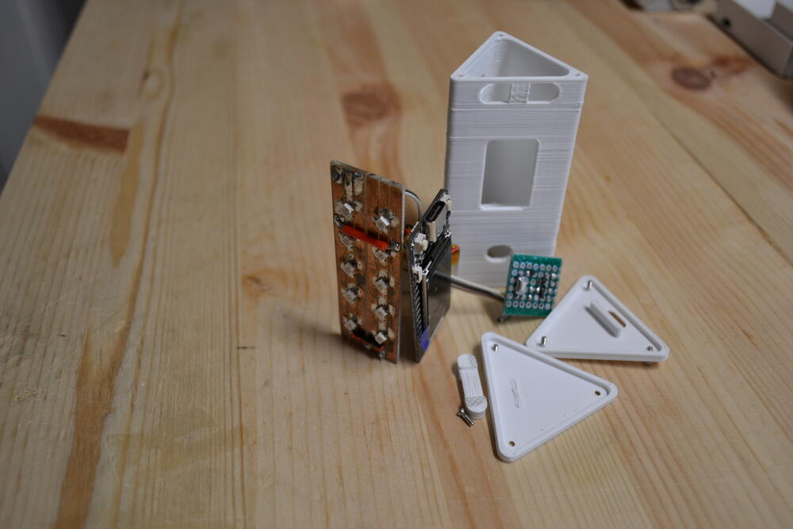
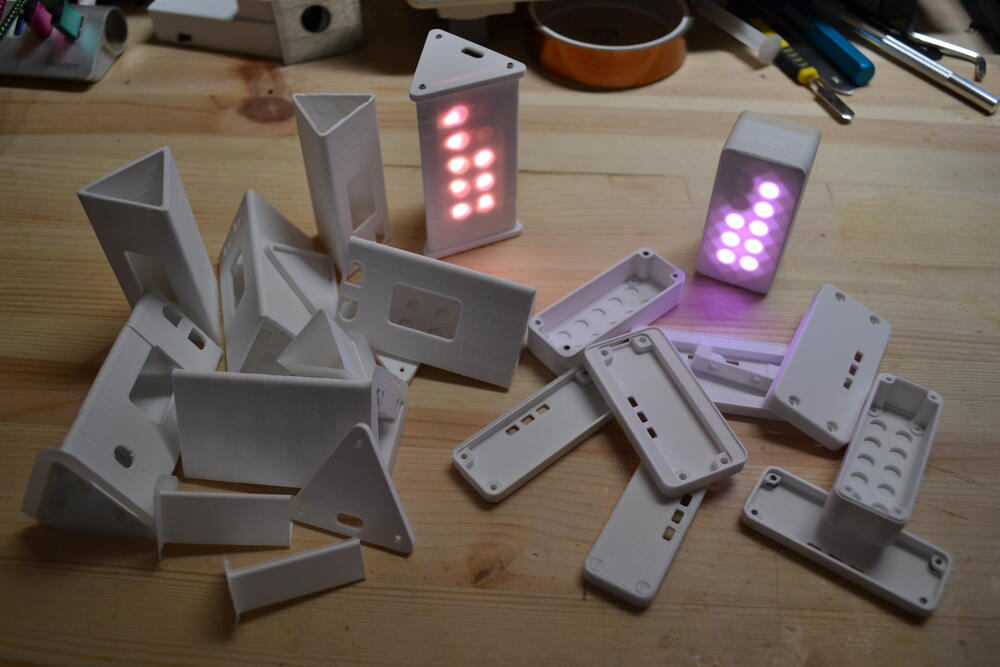
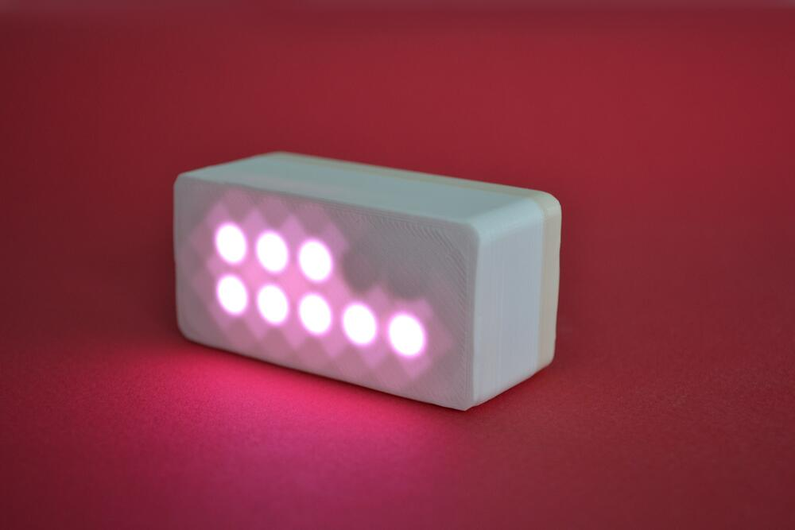

Traduction de la [page kickstarter](https://www.kickstarter.com/projects/jonmrico/glowtimer-timekeeping-for-small-humans).

<!--more-->

## Un "minuteur visuel"

Le Glowtimer est un minuteur qui utilise des diodes électroluminescentes, une pour chaque minute.

C'est un outil d'une simplicité trompeuse, mais très utile pour ma jeune fille. Voici pourquoi :

Notre fille de 3 ans est très, disons, énergique lorsqu'il est presque l'heure d'aller au lit.

Nous avons essayé de lui dire qu'elle pouvait jouer "cinq minutes de plus" avant d'aller au lit, mais cela ne fonctionne pas très bien.
Elle ne sait pas encore lire l'heure, et la fin de la récréation lui semble donc abrupte et soudaine.

Nous avons acheté un minuteur mécanique, style "œuf", mais elle voulait juste jouer avec à cause du bruit du tic-tac. Nous avons également essayé un sablier, mais ça a pas trop marche non plus.

J'ai alors créé une première version du Glowtimer, qui comporte une seule lumière pour chaque minute.

Maintenant, il est très facile pour elle de savoir combien de temps il reste, et il y a un signal sonore une minute avant que le temps ne soit écoulé.

La fin d'une activité, qu'il s'agisse de jouer aux lego, regarder la télévision ou de n'importe quoi d'autre, est maintenant beaucoup moins chaotique pour nous tous.

## Comment ça marche

Il s'agit de 10 lampes qui représentent chacune une minute. Cela signifie qu'il peut compter à rebours à partir de dix minutes. On peut penser que c'est restrictif, mais 5 minutes suffisent souvent pour mettre fin à une activité. 

Le réglage est facile : deux boutons (+ et -) permettent d'augmenter ou de diminuer le temps restant.

L'appareil est doté d'une petite batterie rechargeable et peut être rechargé à l'aide d'un câble usb-c (téléphone) standard. Cela signifie qu'il peut être utilisé non seulement à la maison, mais aussi en voyage. En prime, vous n'avez pas besoin d'emporter (ou d'oublier) un autre chargeur.

## Ça pourrait pas juste être une application?

Il s'agit d'un objet a "usage unique": il est plus facile pour l'enfant a associer le minuteur a la fin d'une activité, plutôt que un téléphone qui est utilise pour tout plein d'autres choses.

En plus, son fonctionnement est quasi-instantané : il s'allume en appuyant sur un seul bouton et est déjà réglé sur 5 minutes. 
Pas besoin de déverrouiller un téléphone, de trouver la bonne application, de le verrouiller à nouveau, etc.

## Plan de fabrication

Le plan est de lancer la fabrication en utilisant le crowdfunding, et de vendre par la suite dans les magasins de vêtements et de jouets pour enfants.

L'aspect logiciel est trivial, il a juste besoin d'être peaufiné.

J'ai également réalisé un prototype de circuit imprimé avec les composants finaux. Il a été validé après quelques modifications mineures. 
La partie électronique est donc presque terminée.

Ce qui est difficile est le boîtier, je n'ai pas d'expérience en matière de moulage par injection. Je vais devoir faire appel à un consultant pour m'aider dans ce domaine.

Le prototype que vous voyez sur les photos a été imprimé en 3D, et le boîtier moulé par injection devrait avoir un meilleur aspect.

J'ai déjà contacté des fabricants pour obtenir des devis sur les étapes de
fabrication mécanique et électronique.

## Mais si mon enfant grandit ? Ou si je ne suis pas un enfant ?

Pas de problème !

Ce minuteur peut être reconverti en outil d'apprentissage de la programmation.
Ou comme plate-forme de programmation en général

J'ai conçu le matériel avec ce cas d'utilisation à l'esprit dès le départ :
- il est base sur le microcontrôleur rp2040, qui est très bien supporté par de nombreux environnements de codage
- il est (re)programmable via le port de "charge" usb-c
- il dispose de 10 LED, de 2 boutons et d'un buzzer en tant qu'interfaces
- il inclut même les empreintes pour les connecteurs STEMMA et GROVE (soudure nécessaire)

Des instructions sur l'utilisation d'Arduino, Microphython et uLisp avec le Glowtimer seront fournies.
Le logiciel et le schéma électronique seront également disponibles au téléchargement.

## Les prototypes

Quelques notes sur les prototypes :)

### Premier prototype

Le prototype initial a été réalisé avec une carte ESP32 qui traînait dans mon
bureau et des LED soudées à la main qui étaient à l'origine destinées à mon
clavier.

Afin de ne pas épuiser la batterie, un circuit de coupure d'alimentation a dû
être réalisé. C'est la petite carte que vous voyez sur les photos.

Comme vous pouvez le voir, j'ai du itérer un peu pour le boitier !

### Second prototype

J'ai refait la conception de zéro de manière à ce qu'il puisse être fabriqué en série.
Ce prototype a été réalisé pour valider cette nouvelle conception.

Les composants ont été placés à la main et soudés à la maison à l'aide d'une
plaque chauffante. Quelques retouches ont été nécessaires pour que tout
fonctionne. Mais la conception générale et le choix des composants ont été
validés !

## Qui sommes-nous

Je m'appelle Jonathan Rico, et je suis papa d'une petite fille. Mais aussi
ingénieur logiciel pour une entreprise de semiconducteurs en Norvège

J'ai fait des études d'Électronique Embarquée. Même si je ne fais que du
logiciel au travail, je m’intéresse encore a la conception de matériel
électronique en tant que hobby.

Vous pouvez voir quelques-uns de mes projets sur mon site perso:
[jonathan.rico.live](https://jonathan.rico.live/projects/list).
