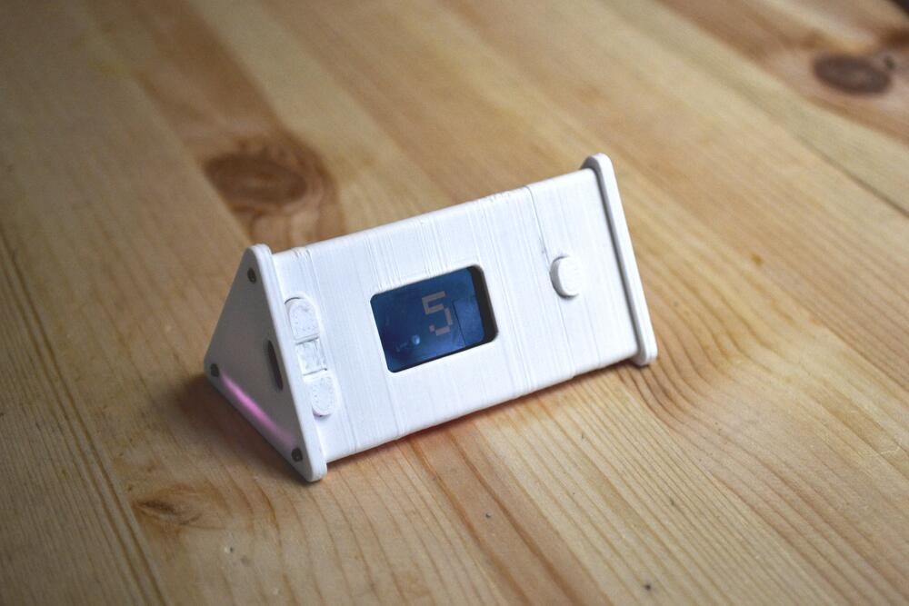
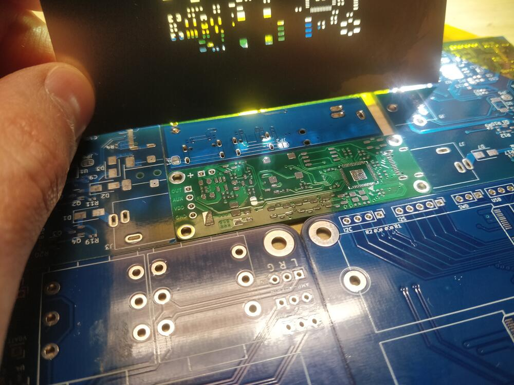
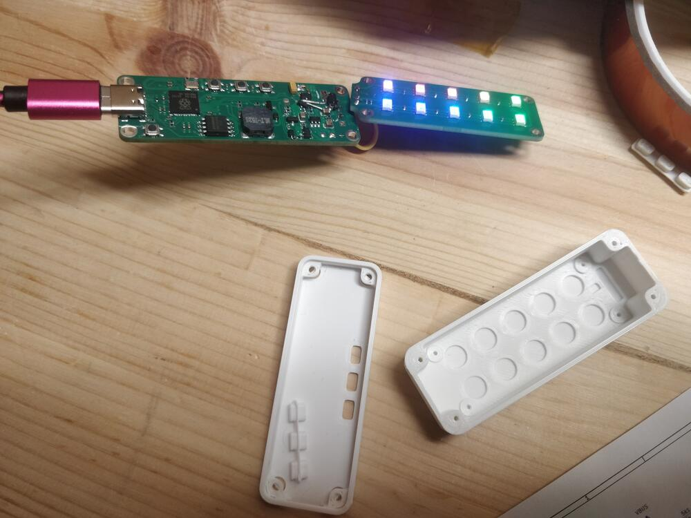
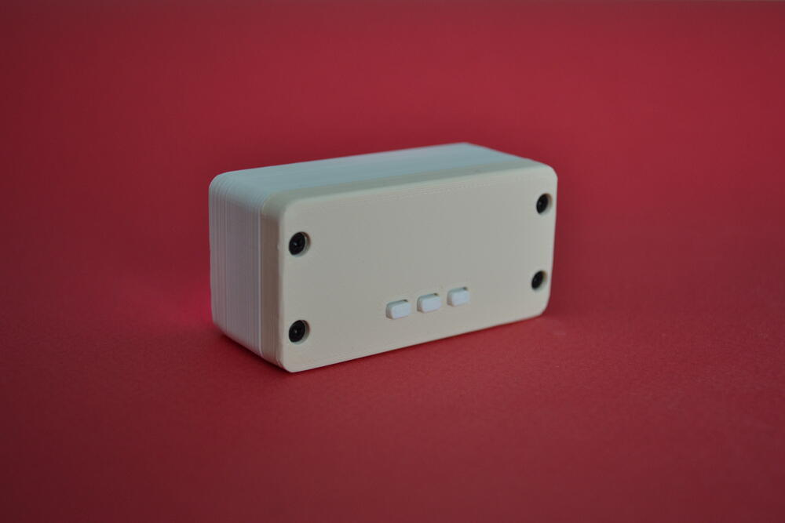

This is a copy of the campaign text [on kickstarter](https://www.kickstarter.com/projects/jonmrico/glowtimer-timekeeping-for-small-humans).

<!--more-->

## Story

The Glowtimer is a timer that uses LEDs, one for each minute.

Deceptively simple, but very useful with my young daughter. Here's why:

Our 3 year old daughter is very, let's say, energetic when it's almost time to go to bed.

We've tried to tell her that she can play for "five more minutes" before going to bed, but that doesn't work out so well.
She can't properly read time yet, so the end of playtime feels abrupt and sudden.

We bought a mechanical timer egg, but she just wanted to play with it because of the ticking noise. We also tried an hourglass but it didn't stick.

Then I made a first version of the Glowtimer, that has a single light for every minute.
Now it's very easy for her to know how much time is left, plus there is an audio cue one minute before time is over.

Ending an activity, be it playtime or TV, anything really is now much less chaotic for all of us.

## How it works

It's 10 lights that each represent one minute each. That means it can count down from ten minutes. You might think this is limiting, but 5 minutes are often enough to transition off any activity.

Setting it is easy: Two (+ and -) buttons increase and decrease the time left.

It has a small rechargeable battery and is rechargeable with a standard usb-c (phone) cable. That means it can be used not just at home, but even while traveling. Bonus is you don't need to bring (or forget) yet another charger.

## Why not a phone app?

This is a purposeful object, it's easier for the child to understand what and why we're using it.

Also, operation is near-instantaneous: it turns on at the touch of a single button, and is already set to 5 minutes. No faffing around with unlocking a phone, finding the correct app, locking it again, etc..

## Plan and schedule

The plan is to launch manufacturing using crowdfunding, and sell through children's clothing & toy stores afterwards.

The software side of things is trivial, just needs a bit of polish.

I also have made a prototype circuit board with the final components. It was validated after a few minor modifications. 
Therefore the electronics part is nearly complete. Another design-for-manufacturing pass should be all that is left.

The big unknown is the enclosure, as I don't have experience with injection-molding. I will have to bring in a consultant to help me with this.

The prototype that you see in the pictures has been 3d-printed, and the injection-molded case should look better.

I have already reached out to manufacturers for budgetary quotes on both mechanical and electronics manufacturing steps.

## But what if my kid grows up? Or what if I'm not a kid?

No worries!
This timer can be repurposed as a tool to learn programming. Or as a general project board.

I have designed the hardware with that use-case in mind from the start: 
- it uses the rp2040 microcontroller, that is very well supported by a lot of coding environments
- it is (re)programmable via the usb-c "charging" port
- it has 10 LEDs, 2 buttons and a buzzer to play with
- it even includes the footprints for STEMMA and GROVE connectors (soldering required)

Instructions on how to use Arduino, Microphython and uLisp with the Glowtimer will be provided.
The software and schematic will also be made available to download.

## Making the prototypes

Details for the nerds.

### Initial prototype

The initial prototype was made with an ESP32 dev-board I had lying around and hand-soldered LEDs that were originally destined for my keyboard.

In order to not drain the battery, a bespoke power-cut circuit also had to be made. This is the small board you see in the pictures. 

As you can see, enclosure design went through a few iterations!

### Second prototype

I redesigned the hardware properly so it would be able to be mass-manufactured. This prototype was made to validate that design.

Components were placed by hand and soldered at home with a hotplate.
A few touch-ups were necessary for the design to work. But the overall design and component selection was validated!

## About me

I'm Jonathan Rico, a dad and also an engineer (at a scandinavian semiconductor company).

Although I only deal with software at work, my formal education was in Embedded Electronics. I still enjoy designing and prototyping hardware as a hobby.

You can find some of those projects on my website [jonathan.rico.live](https://jonathan.rico.live/projects/list).

## Risks and challenges

I believe in reducing the number of unknowns in any project, that's why I thought it'd be best to keep the feature list as small as possible, distilling the product to its essence.

For example, a feature I would really have liked to have is having Bluetooth and a companion app for configuration and notifications.
But that implies having a radio chip and dealing with expensive radio and Bluetooth certifications. 

Although I have done design-for-manufacturing at a previous job, I have never mass-produced any product on my own.

To mitigate this risk, I will be working closely with a so-called "turnkey" manufacturing partner that will be able to guide me through it all and prevent expensive mistakes.

In the worst case, if the project fails, all design files will be made available to backers.

## Environmental commitments

### Long-lasting design

How will you maximize the life of what you’re making?

The GlowTimer is easily opened to change the battery or perform repairs. The full schematic will also be available (some time after the rewards ship) in order to facilitate advanced repairs.

### Reusability

How will you keep materials and packaging out of the landfill?

The GlowTimer is designed to be repurposed as a platform for learning how to code (program). 
Also, packaging will be minimal, and use cardboard wherever possible.
