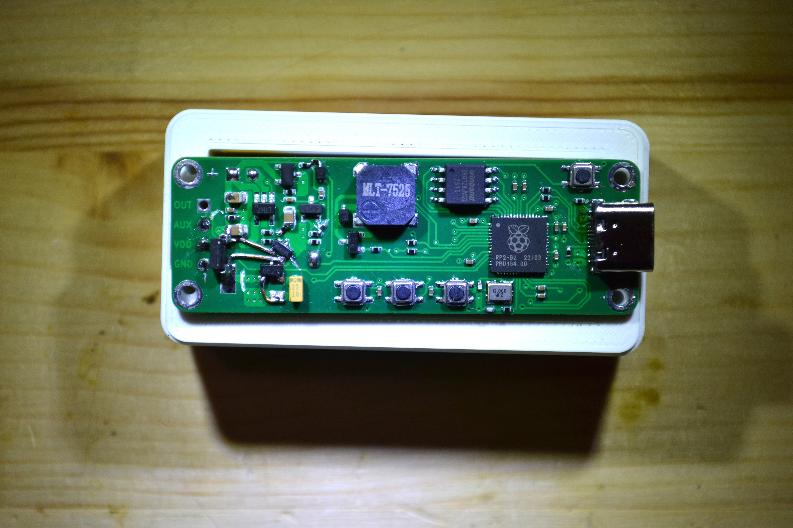

As [promised](https://www.kickstarter.com/projects/jonmrico/glowtimer-timekeeping-for-small-humans/posts/4098732), here are the design filed I used to make the GlowTimer that is seen in the Kickstarter video and pictures.

The files are not perfect, as this was still a prototype.

The electronics in particular are not buildable as-is, as a good amount of modifications need to be made for the board to start up.

Read the `README.txt` files in `software/` and `electronics/` for more information.

With all the disclaimers out of the way, here are the files:

[glowtimer-design-files.zip](./glowtimer-design-files.zip)

Cheers!

