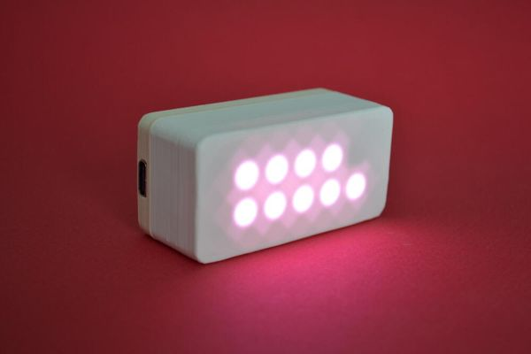

# Bienvenue sur le blog du GlowTimer!

## En bref

Le GlowTimer est un minuteur visuel: Il montre le temps qu'il reste en utilisant des lumieres LED, a raison d'une LED par minute.
Il a ete concu pour aider les enfants a transitionner d'une activite a une autre en evitant les frustrations. Par exemple jouer aux lego puis aller se preparer au dodo.

## Comment se le procurer?

Le GlowTimer est actuellement en campagne de "Crowd Funding" sur le site Kickstarter: [Glowtimer: Timekeeping for small humans](https://www.kickstarter.com/projects/jonmrico/glowtimer-timekeeping-for-small-humans).
