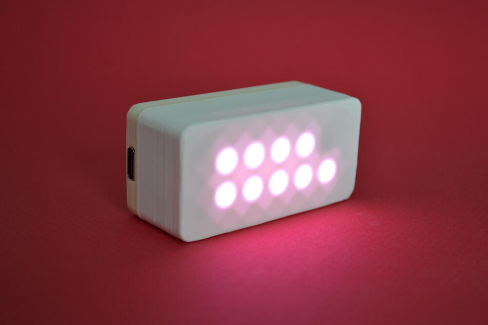

# Welcome to the GlowTimer blog!

## In a nutshell 

The GlowTimer is a visual countdown timer. It shows time one minute per LED. It has been designed to help children transition from activities without the fuss.

## Get yours!

The campaign is currently live on kickstarter: [Glowtimer: Timekeeping for small humans](https://www.kickstarter.com/projects/jonmrico/glowtimer-timekeeping-for-small-humans).
